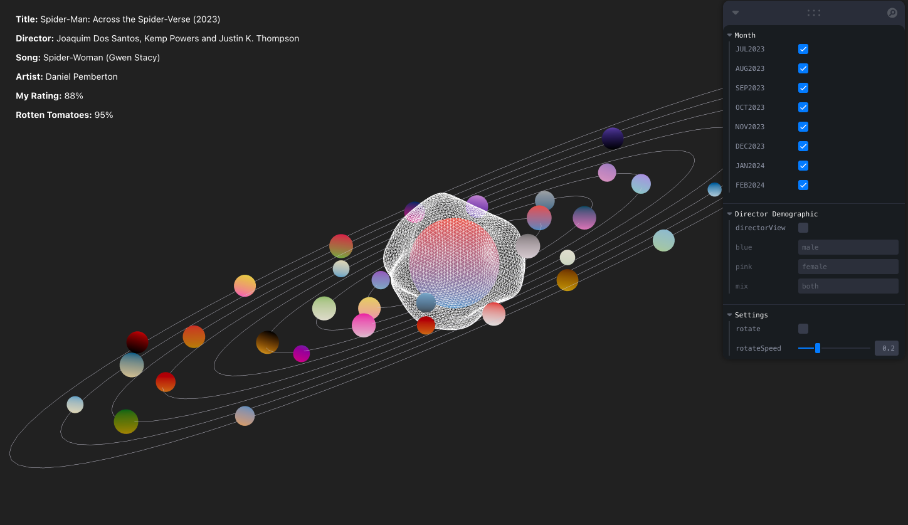

## About The Visualization

Open [https://personal-solar-system.vercel.app/](https://personal-solar-system.vercel.app/) to view the app!

 
I wanted to visualize all the movies and mini tv series I watched in the past eight months and decided to display it as a solar system. I used React Three Fiber to build the website, so the solar system components are all 3D!
        

        <ul>
          <li>Orbit controls are enabled, so you can zoom in and out, rotate in any direction, and pan the camera around the scene. Each ring represents a month which is listed out on the right panel of the screen. </li>
          <li>You can click a month to view the movies/series I watched during that month, and unclick to make that month disappear. </li>
          <li>Each movie/series is represented by a planet, and the colors represent the movie's/series' color palette. </li>
          <li>The size of each planet represents my rating of that particular movie/series, which is determined by several factors including the storytelling/plot, characters, memorability, and the soundtrack. </li>
          <li>You can listen to my favorite song from the soundtrack by clicking on a movie planet. </li>
          <li>Additional details about the movie/series and audio can be found on the top left on the screen. </li>
          <li>Lastly, if you click on the director view toggle in the GUI, you can watch an animation I made to show which movies/series were directed by a male and which were directed by a female. </li>
        </ul>
